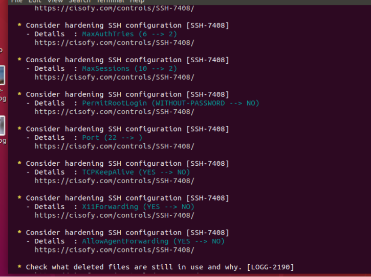
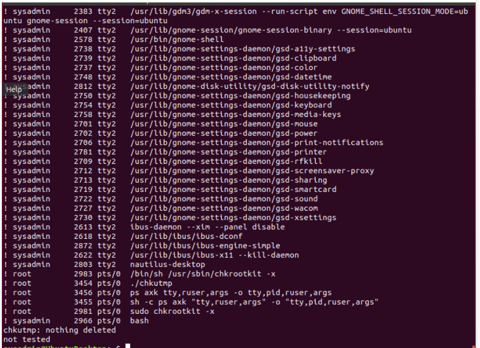

## Week 4 Homework Submission File: Linux Systems Administration

### Step 1: Ensure/Double Check Permissions on Sensitive Files

1. Permissions on `/etc/shadow` should allow only `root` read and write access.

    - Command to inspect permissions: ` ls -l shadow `

    - Command to set permissions (if needed): ` sudo chmod 600 shadow`

2. Permissions on `/etc/gshadow` should allow only `root` read and write access.

    - Command to inspect permissions: ` ls - l gshadow`

    - Command to set permissions (if needed): `sudo chmod 600 gshadow`

3. Permissions on `/etc/group` should allow `root` read and write access, and allow everyone else read access only.

    - Command to inspect permissions: ` ls -la`

    - Command to set permissions (if needed): `sudo chmod 644 group`

4. Permissions on `/etc/passwd` should allow `root` read and write access, and allow everyone else read access only.

    - Command to inspect permissions: ` ls -la`

    - Command to set permissions (if needed): `sudo chmod 644 passwd`

### Step 2: Create User Accounts

1. Add user accounts for `sam`, `joe`, `amy`, `sara`, and `admin`.

    - Command to add each user account (include all five users):
    `sudo useradd joe`
    `sudo useradd sam`
    `sudo useradd amy`
    `sudo useradd sara`
    `sudo useradd admin`

2. Ensure that only the `admin` has general sudo access.

    - Command to add `admin` to the `sudo` group: ` sudo usermod -G sudo admin` 

### Step 3: Create User Group and Collaborative Folder

1. Add an `engineers` group to the system.

    - Command to add group: `sudo addgroup engineers`

2. Add users `sam`, `joe`, `amy`, and `sara` to the managed group.

    - Command to add users to `engineers` group (include all four users):
    `sudo usermod -G engineers sara`
    `sudo usermod -G engineers joe`
    `sudo usermod -G engineers amy`
    `sudo usermod -G engineers sam`

3. Create a shared folder for this group at `/home/engineers`.

    - Command to create the shared folder: `sudo mkdir engineers`

4. Change ownership on the new engineers' shared folder to the `engineers` group.

    - Command to change ownership of engineer's shared folder to engineer group: `sudo chown :engineers /home/engineers/`

### Step 4: Lynis Auditing

1. Command to install Lynis: `sudo apt install lynis `

2. Command to see documentation and instructions: ` man lynis`

3. Command to run an audit: `sudo lynis audit system`

4. Provide a report from the Lynis output on what can be done to harden the system.

    - Screenshot of report output:  

### Bonus
1. Command to install chkrootkit: `sudo apt install chkrootkit`

2. Command to see documentation and instructions: `man chkrootkit`

3. Command to run expert mode: `sudo chkrootkit -x`

4. Provide a report from the chrootkit output on what can be done to harden the system.
    - Screenshot of end of sample output: 

---
© 2020 Trilogy Education Services, a 2U, Inc. brand. All Rights Reserved.
