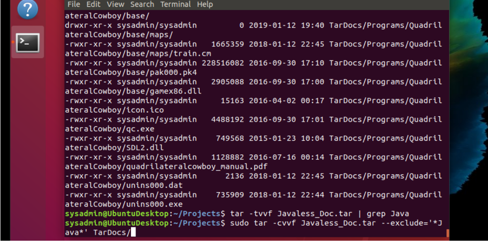
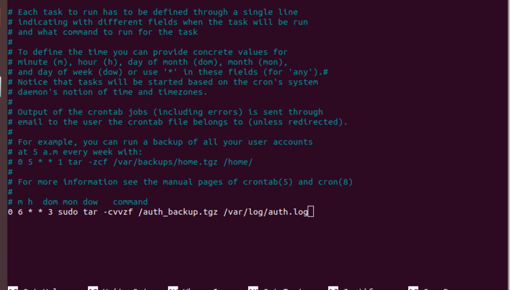
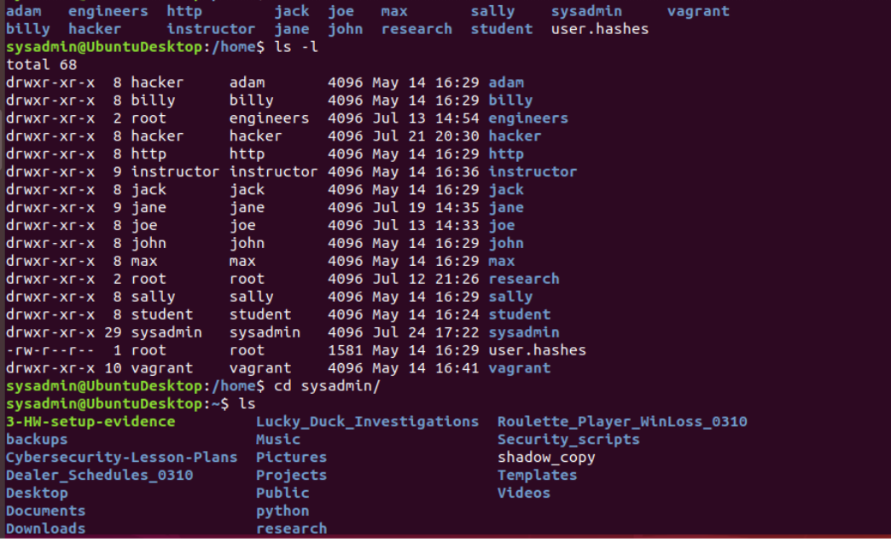
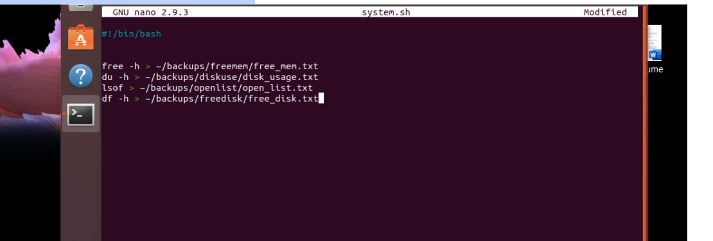
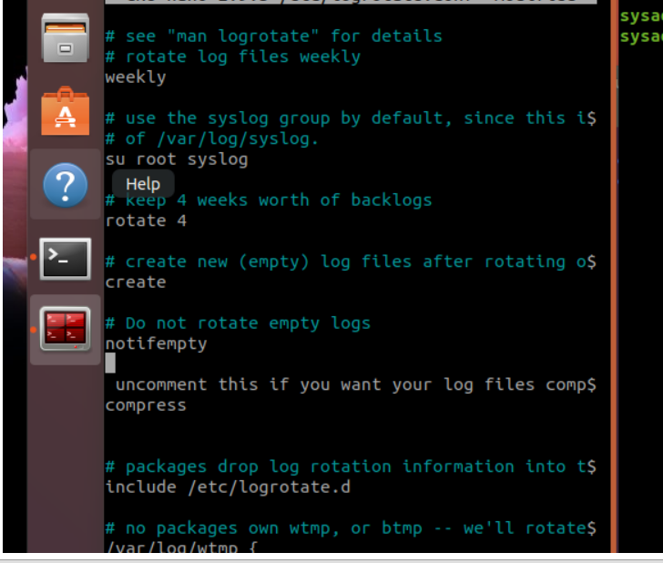
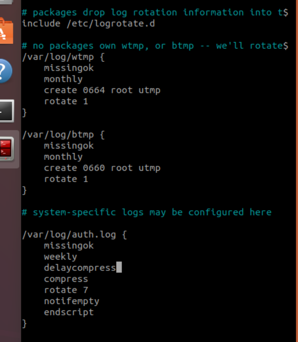

## Week 5 Homework Submission File: Archiving and Logging Data

Please edit this file by adding the solution commands on the line below the prompt.

Save and submit the completed file for your homework submission.

---

### Step 1: Create, Extract, Compress, and Manage tar Backup Archives

1. Command to **extract** the `TarDocs.tar` archive to the current directory:
`tar -xvvf TarDoc.tar` and

2. Command to **create** the `Javaless_Doc.tar` archive from the `TarDocs/` directory, while excluding the `TarDocs/Documents/Java` directory:
`sudo tar -cvvf Javaless_Doc.tar --exclude='./TarDocs/Documents/Java' TarDocs/`
 `sudo tar -cvvf Javaless_Doc.tar --exclude='*Java*' TarDocs/`


3. Command to ensure `Java/` is not in the new `Javaless_Docs.tar` archive:
`tar -tvvf Javaless_Doc.tar | grep Java`



 


**Bonus** 
- Command to create an incremental archive called `logs_backup_tar.gz` with only changed files to `snapshot.file` for the `/var/log` directory:

#### Critical Analysis Question

- Why wouldn't you use the options `-x` and `-c` at the same time with `tar`?
`-x is needed to extract the file and -c is to create a file. Which can not be done at the same time.`

---

### Step 2: Create, Manage, and Automate Cron Jobs

1. Cron job for backing up the `/var/log/auth.log` file:
` crontab -e`
`0 6 * * 3 sudo tar -cvvzf /auth_backup.tgz /var/log/auth.log`



---

### Step 3: Write Basic Bash Scripts

1. Brace expansion command to create the four subdirectories:
`mkdir -p ~/backups/{freemem,diskuse,openlist,freedisk}`



2. Paste your `system.sh` script edits below:

    ```bash
    #!/bin/bash
    [Your solution script contents here]
    ```#!/bin/bash
    free -h > ~/backups/freemem/free_mem.txt
    du -h > ~/backups/diskuse/disk_usage.txt 
    lsof > ~/backups/openlist/open_list.txt 
    df -h > ~/backups/freedisk/free_disk.txt 



3. Command to make the `system.sh` script executable:
`sudo chmod +x system.sh `
**Optional**
- Commands to test the script and confirm its execution:
`sudo ./system.sh `

**Bonus**
- Command to copy `system` to system-wide cron directory:

---

### Step 4. Manage Log File Sizes
 
1. Run `sudo nano /etc/logrotate.conf` to edit the `logrotate` configuration file. 

    Configure a log rotation scheme that backs up authentication messages to the `/var/log/auth.log`.

    - Add your config file edits below:
    

    ```bash
    [Your logrotate scheme edits here]
    ```
    

---

### Bonus: Check for Policy and File Violations

1. Command to verify `auditd` is active:
`systemctl status auditd`
2. Command to set number of retained logs and maximum log file size:
`$sudo nano /etc/audit/auditd.conf`
    - Add the edits made to the configuration file below:

    ```bash
    [Your solution edits here]
    ```

3. Command using `auditd` to set rules for `/etc/shadow`, `/etc/passwd` and `/var/log/auth.log`:
`$sudo nano /etc/audit/audit.rules`


    - Add the edits made to the `rules` file below:

    ```bash
    [-w /etc/passwd -p wa -k passwd
    -w /etc/passwd -p wa -k shadow]
    ```

4. Command to restart `auditd`:
`sudo systemctl restart auditd`

5. Command to list all `auditd` rules:
`sudo auditctl -l`
6. Command to produce an audit report:
`$sudo aureport -au`
7. Create a user with `sudo useradd attacker` and produce an audit report that lists account modifications:

8. Command to use `auditd` to watch `/var/log/cron`:
`$sudo auditctl -w /var/log/cron`

9. Command to verify `auditd` rules:
`$sudo auditctl -l`
---

### Bonus (Research Activity): Perform Various Log Filtering Techniques

1. Command to return `journalctl` messages with priorities from emergency to error:

1. Command to check the disk usage of the system journal unit since the most recent boot:

1. Comand to remove all archived journal files except the most recent two:


1. Command to filter all log messages with priority levels between zero and two, and save output to `/home/sysadmin/Priority_High.txt`:

1. Command to automate the last command in a daily cronjob. Add the edits made to the crontab file below:

    ```bash
    [Your solution cron edits here]
    ```

---
© 2020 Trilogy Education Services, a 2U, Inc. brand. All Rights Reserved.
