# Network Forensic Analysis Report

_TODO_ Complete this report as you complete the Network Activity on Day 3 of class.

## Time Thieves 
You must inspect your traffic capture to answer the following questions:

1. What is the domain name of the users' custom site?

`Frank-n-Ted-DC. Frank-n-ted.com`

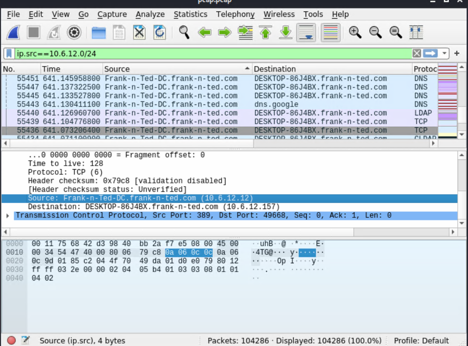 

2. What is the IP address of the Domain Controller (DC) of the AD network?

`IP address: 10.6.12.12`

3. What is the name of the malware downloaded to the 10.6.12.203 machine?

  `	june11.dll`

  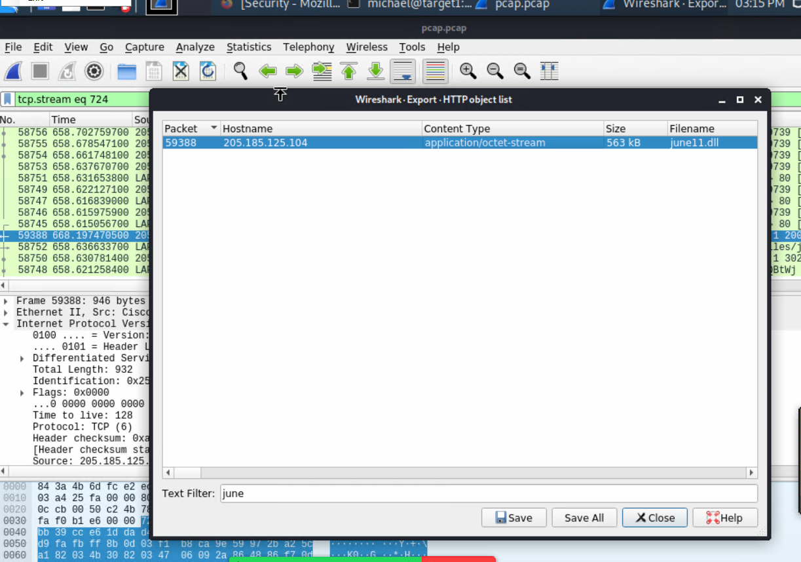 

4. Upload the file to [VirusTotal.com](https://www.virustotal.com/gui/). 
5. What kind of malware is this classified as?

`Exported file captured from wireshark onto Desktop and uploaded into virustotal.` 
 
-Trojan.Mint.Zamg.O

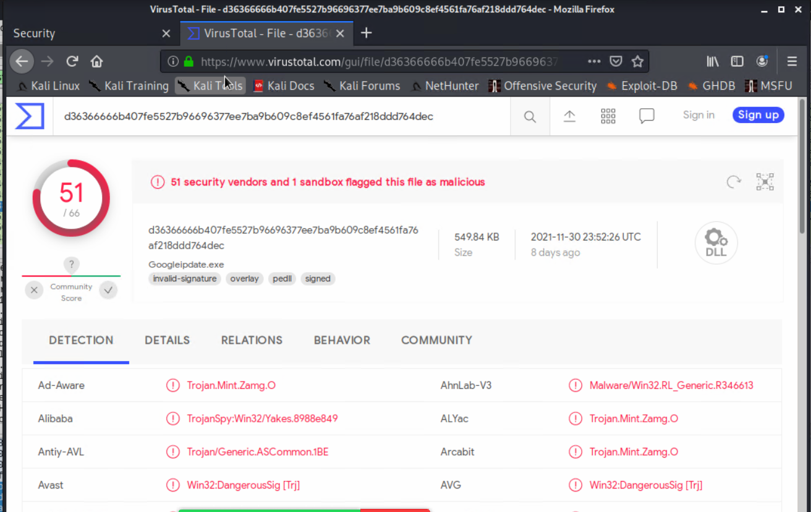 

---

## Vulnerable Windows Machine

1. Find the following information about the infected Windows machine:

    -Googled how to find username, host name, and mac address on pcap file

    Click here: [Paloalto](https://unit42.paloaltonetworks.com/using-wireshark-identifying-hosts-and-users/)

    - Host name

          Rotterdam-PC
    
    - IP address

           172.16.4.205

    - MAC address
    
          LenovoEM_b0:63:a4 (00:59:07:b0:63:a4)

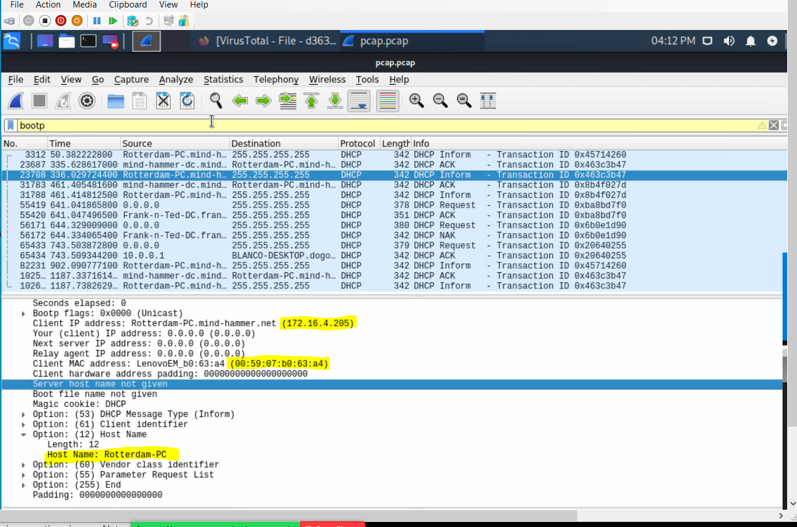 

2. What is the username of the Windows user whose computer is infected?

Used ip ==172.16.4.205 && kerberos.CNameString 

        matthijs.devries

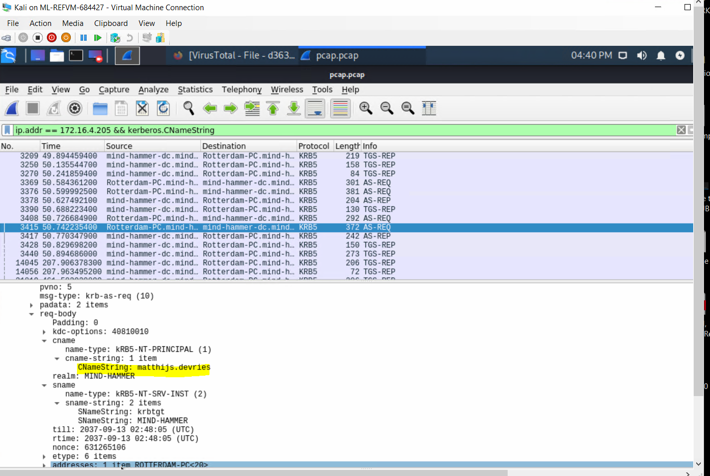 

3. What are the IP addresses used in the actual infection traffic?

Click tab `Statistics`  
Go to Conversations  
Click IPV4  
Click Packets to bring the most activities to the top  
This will bring packets that are infected to the top  

       185.243.115.84
       172.16.4.205
       23.43.62.169
       64.187.66.143 
       Traffic from 185.243.115.84 infected 172.16.4.205

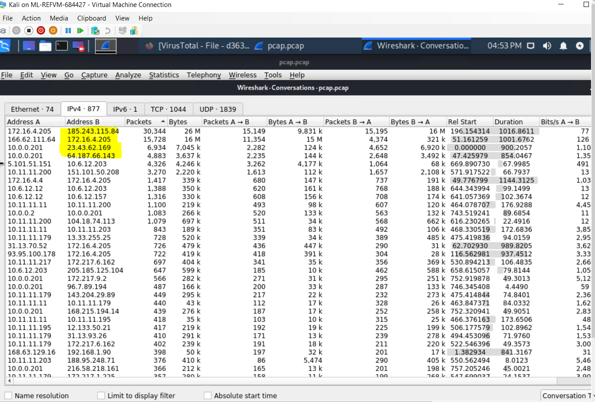 

4. As a bonus, retrieve the desktop background of the Windows host.

Click `File` tab  
click Export Objects  
Search filter for image  

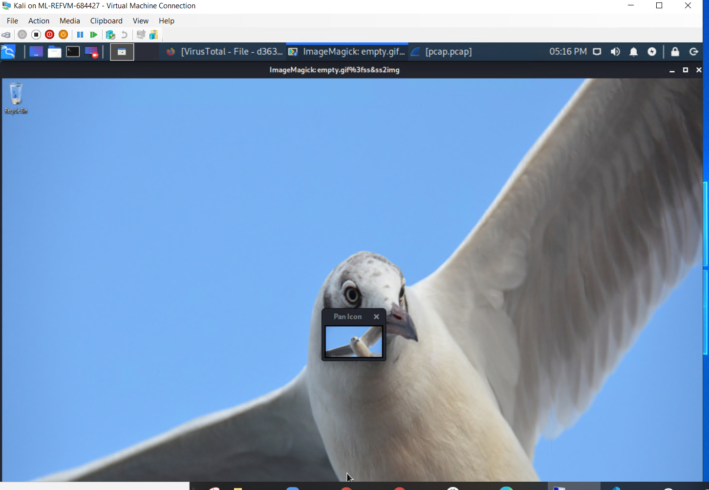 

---

## Illegal Downloads

1. Find the following information about the machine with IP address `10.0.0.201`:
   

        Search:
        ip.addr == 10.0.0.201 && DHCP

          MAC address: Msi_18:66:c8 (00:16:17:18:66:c8)
          Windows username: elmer.blanco 
          OS version: Windows NT 10.0; Win64; x64

     
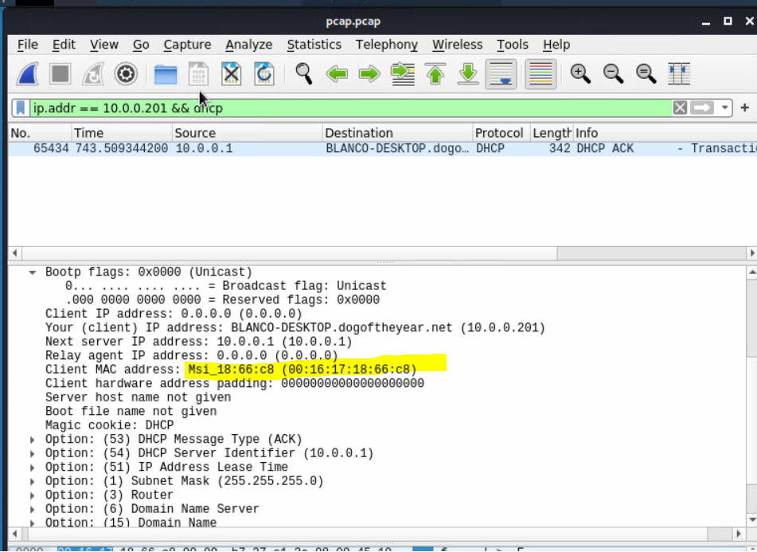 

 

      Search for
      ip.src == 10.0.0.201 &&  kerberos.CNameString

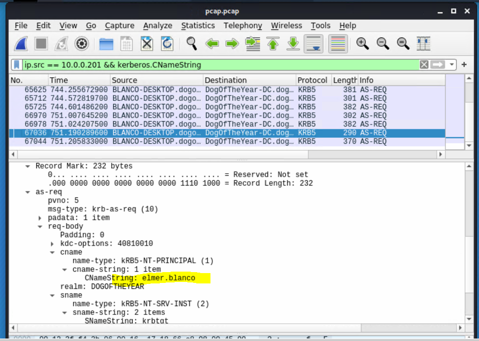 

      Search for ip.src == 10.0.0.201 && http.request

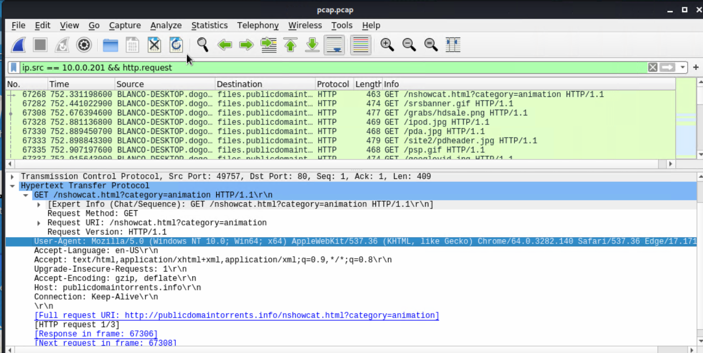 

2. Which torrent file did the user download?

       Search for: 
       ip.add == 10.0.0.201 && (http.request.uri contains ".torrent")

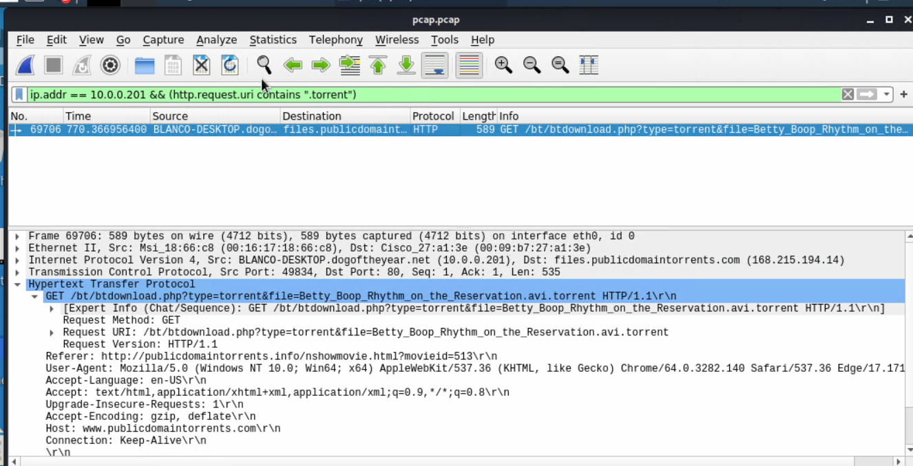 

 

 

