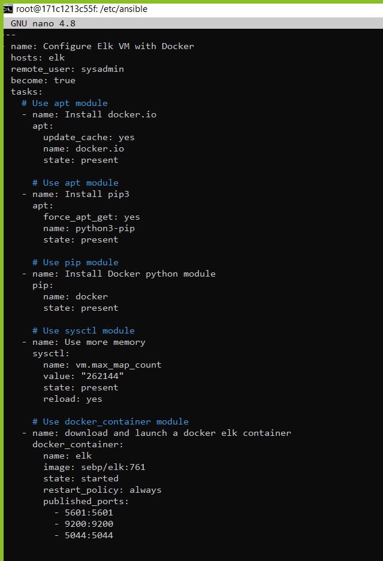

## Automated ELK Stack Deployment

The files in this repository were used to configure the network depicted below.

These files have been tested and used to generate a live ELK deployment on Azure. They can be used to either recreate the entire deployment pictured above. Alternatively, select portions of the **.yml** file may be used to install only certain pieces of it, such as Filebeat.

   [Install Elk-playbook](./images/install-elk.yml)
  

This document contains the following details:
- Description of the Topology
- Access Policies
- ELK Configuration
  - Beats in Use
  - Machines Being Monitored
- How to Use the Ansible Build

### Description of the Topology

The main purpose of this network is to expose a load-balanced and monitored instance of DVWA, the D*mn Vulnerable Web Application.

Load balancing ensures that the application will be highly **available**, in addition to restricting **access** to the network.

 
 
     Load balancers receives traffic (external Ip address) and distributes it to server.

      A jump box is a gateway, which is a firewall and router combined. The jump box is also a provisioner that is used to configure VM or containers

Integrating an ELK server allows users to easily monitor the vulnerable VMs for changes to the **datas** and system **logs**.

      Filebeat is installed to collect data from file system (web servers).

     
      Metricbeat collects machine metrics such as cpu and ram, etc.

 
The configuration details of each machine may be found below.

| Name     | Function | IP Address    | Operating System  |
|----------|----------|---------------|------------------ |
| Mary     |  Host    |Temp 74.56.15.2| Windows 10        |
| Jump Box | Gateway  | 10.0.0.4      | Linux Ubuntu 18.4 |
| Web-1    |  DVWA    | 10.0.0.2      | Linux Ubuntu 18.4 |
| Web-2    |  DVWA    | 10.0.0.3      | Linux Ubuntu 18.4 |
|Elk-Server|Monitoring| 10.1.0.6      | Linux Ubuntu 18.4 |

### Access Policies
The machines on the internal network are not exposed to the public Internet. 

Only the **Jumpbox provisioner** machine can accept connections from the Internet. Access to this machine is only allowed from the following IP addresses:

    
      Local personal IP address: Temp 74.56.15.2

Machines within the network can only be accessed by **Jumpbox Provisioner**.

      Jumpbox private IP 10.0.0.4 via port 22 SSH
      Temp 74.56.15.2 port 5601 TCP

A summary of the access policies in place can be found in the table below.

| Name     | Publicly Accessible | Allowed IP Addresses     |
|----------|---------------------|--------------------------|
| Mary     | Yes                 |10.0.0.0/16 - 10.1.0.0/16 | 
| Jump Box | Yes                 |10.0.0.0/16 - 10.1.0.0/16 |
| Web-1    | No                  |10.0.0.0/16 - 10.1.0.0/16 |
| Web-2    | No                  |10.0.0.0/16 - 10.1.0.0/16 |
|Elk-Server| No                  |10.1.0.6                  |               

### Elk Configuration

Ansible was used to automate configuration of the ELK machine. No configuration was performed manually, which is advantageous because...

      The main advantage of automating configurations with Ansible is to prevent human errors and help install and updated web servers.

The playbook implements the following tasks:

- Install Docker.io
- Install python (pip3)
- Install Docker module
- Increase memory  
- Download and launch docker elk container
- Enable service docker on boot
  
- 

The following screenshot displays the result of running **docker ps** after successfully configuring the ELK instance.

### Target Machines & Beats
This ELK server is configured to monitor the following machines:

            Web-1 10.0.0.2
            Web-2 10.0.0.3 

We have installed the following Beats on these machines:

            Filebeat
            Metricbeat

These Beats allow us to collect the following information from each machine:

**Filebeat is a tool used to collect data, log events, and sends it to Elastic search, Logstash, and Kibana.**

*In example: If an attacker were to log into the system to change a password, that information will log into Logstash*
 

   

**Metricbeat is also a tool used to collect metric datas like CPU, memory, or ram from machines and sent to Elasticsearch, Logstash, and Kibana.**

*In example:*

### Using the Playbook
In order to use the playbook, you will need to have an Ansible control node already configured. Assuming you have such a control node provisioned: 

        cd /etc/ansible/files then run theses below
        ansible-playbook install-elk.yml
        ansible-playbook filebeat-playbook.yml and ansible-playbook
        metricbeat-playbook.yml
        http://20.94.250.42:5601/app/kibana

### Configure ELK VM with Docker  

 

 

### Install and launch filebeat

### Install and launch metricbeat

 

### Kibana

